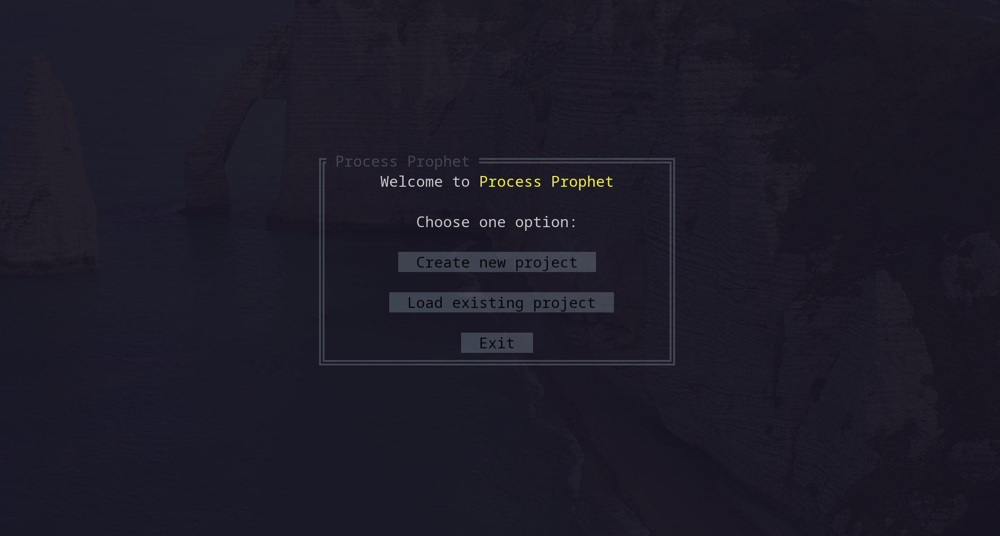

# Welcome to Process Prophet 🔮
Process prophet is a backend server that combines the power of the RMTPP model and process mining techniques. 
In particular, a process twin is created for an existing process that is able to: 
- simulate existing behavior.
- make predictions for ongoing process cases. 

This can provide important insights for project managers while improving decision making and resource allocation.

This model can be implemented in a variety of fields, as long as you have a timestamp, case id and an event name in your data. Therefore, Process Prophet also has a wide variety of possible areas of application. 

We also provide an `API` to agilize integration with other frontend interfaces. 

A CLI in the form of a `terminal user interface` is also provided for endusers that just want to use our provided 
functionalities. 

RMTPP is based on the paper [Recurrent marked temporal point processes: Embedding event history to vector.(KDD 2016)](https://www.kdd.org/kdd2016/papers/files/rpp1081-duA.pdf), and the pytorch implementation was adapted from the [this repository](https://github.com/woshiyyya/ERPP-RMTPP.git).

This is a project created for the lab `Process Discovery with Python` at RWTH Aachen. 


# Integrate our backend into your application
We implemented our backend using a flask backend. Therefore, the backend can also be integrated with 
other frontend projects! If you are a frontend developer/data scientist willing to implement our backend
into your project, **check out the docs**!
[documentation site](https://benjaminoyarzun17.github.io/ProcessProphet/)


# Check out our CLI user guide! 
(link to be added in the near future)


# CLI setup and installation
We assume you have docker installed in your machine. Process prophet does support `CUDA`, however this driver must
be configured manually in the `Dockerfile.servercuda`.

## Run without CUDA
First, build both containers and run them using docker compose:
```sh
docker compose up --build
```
alternatively, to run in background: 
```sh
docker compose up --build -d
```
Now, this is a necessary step to run the CLI after doing docker compose: Ideally create another terminal and run: 
```sh
docker-compose exec cli sh
```
this will enter the container's interactive console. Now type:
```sh
python CLI/main.py
```
This should launch:


## Run with CUDA
First, make sure that you have the right CUDA drivers installed, and also edit the CUDA version in the `Dockerfile.servercuda`. 

Run the following command to build and start both containers:
```sh
docker-compose -f docker-compose-cuda.yaml up
```

Now, this is a necessary step to run the CLI after doing docker compose: Ideally create another terminal and run: 
```sh
docker-compose exec cli sh
```
this will enter the container's interactive console. Now type:
```sh
python CLI/main.py
```