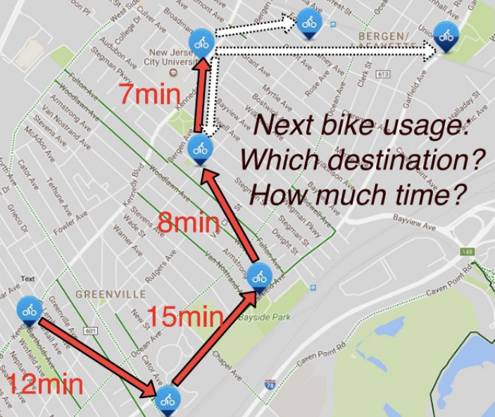

# Welcome to Process Prophet :crystal_ball: 

Process prophet is a backend server that combines the power of the RMTPP model and process mining techniques.
In particular, a process twin is created for an existing process that is able to:

- simulate existing behavior.
- make predictions for ongoing process cases.

This can provide important insights for project managers while improving decision making and resource allocation.

RMTPP is based on the paper [Recurrent marked temporal point processes: Embedding event history to vector.(KDD 2016)](https://www.kdd.org/kdd2016/papers/files/rpp1081-duA.pdf), and the pytorch implementation was adapted from the [this repository](https://github.com/woshiyyya/ERPP-RMTPP.git).

This is a project created for the lab `Process Discovery with Python` at RWTH Aachen.

## So... what does Process Prophet really do? 



Imagine you own a bike rental service with GPS support. Bikes can be booked and released from a mobile application at any location and time in the city. Let's say a user has rented a bike and has been moving around the city, as shown in the image. Now, you are wondering, where is it most likely that the user will park the bike and end the reservation?

You already have data from all users' past reservations. You know where the user made a turn at each intersection and when this happened. This information is all you need to answer your question. Process Prophet is a neural network trained on this historical data and can be used to make predictions about where the user will park the bike and end the reservation.

In particular, you could do the following with Process Prophet: 

1. train the neural network using your historical bike rental data
2. predict what the where your user move next in the city
3. predict when the user will do that next movement
4. predict where the user will end the reservation and when. 
5. get a list of possible paths that the user may take. 
and much more!

Now in general: Process Prophet is a tool that can be applied to any kind of process that has the following attributes: 

1. a case identifier: which session/user /process are we currently talking about?
2. an activity: what are the possible actions that can happen in the process?
3. a timestamp: when does a particular activity happend for a specific case?  
ie. an `event log` is expected.

After feeding this event log to process prophet, a neural network model is generated, that is able to:

- predict when and which the next event is going to happen, given an ongoing process.
- predict more than one step in the future, and get a list of possible "paths" or possible future sequences given an ongoing process.

In particular, Process Prophet has two main components: 

- a CLI for the general user
- an API for programmers who want to implement our functionality into their projects.

## The CLI
For more details, check out the [user manual](https://github.com/BenjaminOyarzun17/ProcessProphet/blob/main/user-manual/user_manual.md)!

# Integrate our backend into your application

We implemented our backend using a flask backend. Therefore, the backend can also be integrated with 
other frontend projects! If you are a frontend developer/data scientist willing to implement our backend
into your project, **check out the docs**!
[documentation site](https://benjaminoyarzun17.github.io/ProcessProphet/)


## CLI setup and installation

We assume you have docker installed in your machine. Process prophet does support `CUDA`, however this driver must
be configured manually in the `Dockerfile.servercuda`.

## Run without CUDA

First, build both containers and run them using docker compose:

```sh
docker compose up --build
```

alternatively, to run in background: 

```sh
docker compose up --build -d
```

Now, this is a necessary step to run the CLI after doing docker compose: Ideally create another terminal and run: 

```sh
docker-compose exec cli sh
```

this will enter the container's interactive console. Now type:

```sh
python CLI/main.py
```

This should launch:


## Run with CUDA

First, make sure that you have the right CUDA drivers installed, and also edit the CUDA version in the `Dockerfile.servercuda`.

Run the following command to build and start both containers:

```sh
docker-compose -f docker-compose-cuda.yaml up
```

Now, this is a necessary step to run the CLI after doing docker compose: Ideally create another terminal and run: 

```sh
docker-compose exec cli sh
```

this will enter the container's interactive console. Now type:

```sh
python CLI/main.py
```
