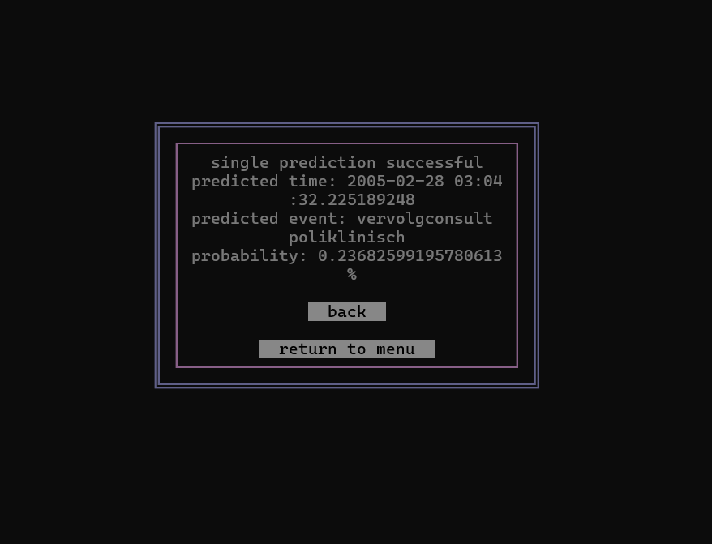
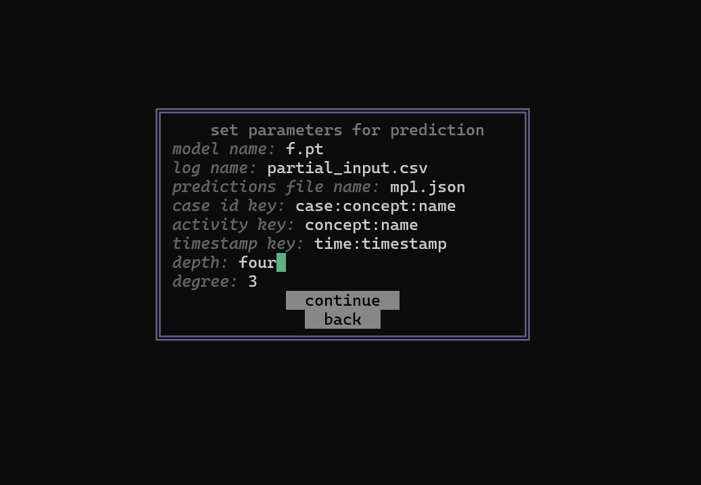

# ProcessProphet 🔮

## About
The aim of ProcessProphet is to overcome one of the fundamental limitations of [process mining](https://en.wikipedia.org/wiki/Process_mining) techniques: they are limited by retrospective models, thus failing to provide forecasts related to future or ongoing process instances. ProcessProphet consists of two subsystems: a backend server with a well defined API and a lightweight CLI frontend.

Its three main objectives are: 
* generate a **process twin** to accurately represent an existing business process. 
* enable predictions of potential future behavior given an incomplete/ongoing sequence of events. 
* further discover a process model that incorporates the predicted future behaviors. 

This is a project created for the lab `Process Discovery with Python` at RWTH Aachen.

## Table of Contents

- [About](#about)
- [Getting Started](#getting-started)
    - [Docker Deployment](#docker-deployment)
        - [Run without CUDA](#run-without-cuda)
        - [Run with CUDA](#run-with-cuda)
    - [Run locally](#run-locally)
        - [Using Conda Environment](#using-conda-environment)
        - [Using Python Virtual Environment](#using-python-virtual-environment)
        - [Setting up the Server](#setting-up-the-server)
- [User Guide / Walkthrough](#user-guide--walkthrough)
    - [Start Screen](#start-screen)
    - [Quick vs. Advanced Mode](#quick-vs-advanced-mode)
    - [Main Screen](#main-screen)
    - [Import and Filter Log](#import-and-filter-log)
    - [Train Neural Network](#train-neural-network)
        - [Training with Hyperparameter Tuning](#training-with-hyperparameter-tuning)
        - [Manual Training](#manual-training)
    - [Make Predictions](#make-predictions)
        - [Single Prediction](#single-prediction)
        - [Multiple Predictions](#multiple-predictions)
    - [Conformance Checking](#conformance-checking)
        - [Motivation](#motivation)
        - [Create Predictive Event Log](#create-predictive-event-log)
        - [Run Process Mining](#run-process-mining)
        - [Run Conformance Checking](#run-conformance-checking)  
- [FAQ](#faq)
- [Glossary and Index](#glossary-and-index)


## Getting Started
To deploy ProcessProphet, you have two options: using Docker or running it directly on your machine.

### Docker Deployment
We assume you have docker installed in your machine. Process prophet does support `CUDA`, however this driver must
be configured manually in the `Dockerfile.servercuda`.

### Run without CUDA

First, build both containers and run them using docker compose:

```sh
docker compose up --build
```

alternatively, to run in background: 

```sh
docker compose up --build -d
```

Now, this is a necessary step to run the CLI after doing docker compose: Ideally create another terminal and run: 

```sh
docker-compose exec cli sh
```

this will enter the container's interactive console. Now type:

```sh
python CLI/main.py
```

This should launch:


### Run with CUDA

First, make sure that you have the right CUDA drivers installed, and also edit the CUDA version in the `Dockerfile.servercuda`.

Run the following command to build and start both containers:

```sh
docker-compose -f docker-compose-cuda.yaml up
```

Now, this is a necessary step to run the CLI after doing docker compose: Ideally create another terminal and run: 

```sh
docker-compose exec cli sh
```

this will enter the container's interactive console. Now type:

```sh
python CLI/main.py
```


### Run locally
You need to first install the dependencies. You can do it via conda or python venv.

#### Using Conda Environment
You can install the environment from the environment.yml file, and activate the environment with the following commands:
```sh
conda env create -f environment.yml
conda activate spp_process_discovery 
```

#### Using Python Virtual Environment
It is also possible to run the application locally by using a virtual environment for python. First you need to create a directory, where the dependencies of the virtual environment are stored. Navigate to the directory with the project, and execute the following command:
```sh
python -m venv venv 
```
In the next step you need to activate your virtual environment and install the needed dependencies for the project. For the operating systems Linux and MacOS you need to execute this command:
```sh
source venv/bin/activate 
```
and for Windows this command:
```sh
venv\Scripts\activate 
```
After the virtual environment is activated use the following command to install the required packages:
```sh
pip install -r requirements.txt 
```
Now you have all the requirements to execute the application.

#### Setting up the Server
Due to the client-server architecture of the application it is necessary to first set up a local host server, so the requests to the backend can be computed and sent back to the frontend for a visualization. After setting up an environment and activating it, use the following command to host a local server:
```sh
python -m server.server 
```
As a result the terminal should look like this, showing the IP-address and also the used port:


In this terminal window you will also see the sent requests caused by interacting with the CLI and e.g. the progress of a training request:


#### Starting the CLI
After successfully setting up a local host server, you need to open a **new terminal**, where the environment (either via conda or a python virtual environment) has to be activated. In the new terminal execute this command to start the command line interface:
```sh
python CLI/main.py
```
If every step was followed you should now be able to see the CLI of the application where all the previously described functionalities can be used. The newly opened window with the CLI should look like this:

## User Guide / Walkthrough
### Start Screen 
When starting the application, this should be the first screen. Here you can either choose to create a completely new project or continue working on a previous project that was already created with the application. 


In the first case a new window will be opened where you can enter the name of the new project, and also see the file path where the new project will be stored. It is important to choose a name that is not already taken in the project's directory, otherwise it will cause an error that will also be indicated. After pressing the `Create project` button the application will create a new directory in the shown path with the entered name and within this directory are more directories where e.g. the computed petri nets or predictions are stored. 


If you decide to load an existing project you get an overview of the existing projects on the right side of the new window. On the left side you can enter which project you want to load. After pressing the `Select` button the application can access the files in the subdirectories of this project e.g. to compute a prediction.


For both options (new project/ existing project) there will also be a new window shortly indicating that the initialization of a new project or the loading of an existing project was successful.


The projects are stored in the `projects` directory of the repository. Creating a new project also creates the following directory structure:
```
projects/
└── project_name/
    ├── decoded_dfs/
    ├── input_logs/
    ├── models/
    ├── multiple_predictions_path/
    ├── partial_traces/
    ├── petri_nets/
    └── predictive_logs/

```
The directory structure is important for several functionalities of ProcessProphet and will be further explained in the following.

### Quick Mode vs. Advanced Mode
Upon launching the application, you will be prompted to choose between Quick Mode and Advanced Mode. Quick Mode provides default parameters for ease of use, while Advanced Mode offers additional options and parameters for users with a more technical background. Advanced Mode includes features such as manual parameter setting in training and adjustable parameters in grid search. It is recommended for users with prior experience in process mining and neural networks, but the main functionalities are also available in Quick Mode.


### Main Screen
After selecting the mode, you will be presented with the main screen, which displays all the different functionalities of the application. Each functionality will be described in detail later on.


### Import and Filter Log	

New event logs are imported with the filesystem through the project directory. The supported file formats are CSV and XES. Just place your file into the `input_logs` folder using your favourite file explorer.

**Event log file format**: make sure that your file as an activity column, a case identifier column and a timestamp column. The activity and timestamp values caracterize an event in a case. Timestamp should be encoded
as datetime types, in particular, see panda's `datetime64` type: [pandas website](https://pandas.pydata.org/). The case identifiers should be integer values.

```
projects/
└── project_name/
    ├── input_logs/
```

The imported files can be preprocessed in the `import and filter log` section, which can be found from the main screen. 
The supported preprocessing functionalities are: 
replacing NaN values with the mode value in the log
removing duplicate rows 
adding a unique start and end activity

### Train Neural Network
You can run predictions either with an already trained neural network model, or you can train a new neural network. To import a nn-model, you need to place the `.pt` file into the `models` subdirectory, alongside the `.config.json` file that contains hyperparameters used for training that model. 
```
projects/
└── project_name/
    ├── models/
```
Then it can be selected later when making predictions. This is also the place where you can find your trained model after training.

For training a new neural network, it is mandatory to place your event log data in the corresponding folder as described in the previous step. Then you can choose between manual training and training with hyperparameter tuning, specifically grid search and random search. 


#### Training with Hyperparameter Tuning

With grid search you need to select upper bound, lower bound and step size, for the parameters #todo 
With random search you need to only select upper and lower bounds for the parameters.
While hyper parameter tuning can be beneficial, especially for users without the necessary expertise to select the right hyperparameters, it is much more computationally expensive than training with manually selected hyperparameters.

#### Manual Training

With manual training you are able to set the hyperparameters yourself. The training parameters are the following:

| Hyperparameter   | Description                                                                                   |
|------------------|-----------------------------------------------------------------------------------------------|
| **use cuda**     | Indicates whether to use GPU acceleration (CUDA) for training. Set to `True` for faster training if a compatible GPU is available. |
| **model name**   | The name of the file where the trained model will be saved.                                   |
| **sequence length** | The length of the input sequences for the model.                                           |
| **embedding dimension** | The dimension of the embedding layer, which maps input features into a vector space.   |
| **hidden dimension** | The number of hidden units in each layer of the neural network.                           |
| **mlp dimension** | The dimension of the multi-layer perceptron (MLP) layer.                                     |
| **learning rate** | The learning rate for the optimizer, which controls the step size during gradient descent.   |
| **batch size**    | The number of samples per batch of computation.                                              |
| **number of epochs** | The number of times the entire training dataset is passed through the network.            |
| **split fraction** | The fraction of the dataset to be used for training, with the remainder used for validation.|
| **log name**     | The name of the log file containing the training data.                                        |
| **case id key**  | The key used to identify individual cases in the log file.                                    |
| **activity key** | The key used to identify activities in the log file.                                          |
| **timestamp key** | The key used to identify timestamps in the log file.                                         |


After training is completed, the training statistics are being displayed. They include the accuracy, recall, f1-score, and also the time error #TODO.


### Make Predictions
With a trained model in the **models** directory, you are now able to make predictions. This can be seen as the core functionality of ProcessProphet. Based on an incomplete process sequence (partial trace) you can create either a single prediction (e.g. a single time-marker pair), or multiple predictions.

**Partial trace format**: The partial traces should be in a `.csv` file and must contain an activity column, a timestamp column, and a case column. These columns should belong to the same case, so the case column requires the same value for all rows (it can be any integer number). 

To make predictions, place a partial trace in the **partial_traces** directory, which will be used to predict the next events and timestamps.
```
projects/
└── project_name/
    ├── models/
    ├── partial_traces/

```
#### Single Prediction
To generate single predictions, the system calculates the next marker and its corresponding timestamp based on the partial trace provided by the user. The user needs to specify the model and the partial trace from the directory to be used for the prediction computation.

The output is then the decoded timestamp, marker, and also its probability:



#### Multiple predictions
To offer more flexibility to the user, the application allows generating multiple predictions instead of just the next predicted event. This can be achieved by specifying two additional parameters: depth and degree. The depth parameter determines the number of consecutive events to be predicted. On the other hand, the degree parameter controls the number of top predictions (with the highest probability) to consider. For example, with a degree of 3, the application creates three sequences in a tree-like structure for each prediction step, where each sequence ends with one of the three highest probable event-time pairs.
The output is a list of all predictive sequences in a json file. This file can be found in the `multiple_predictions_path` directory of the current project.
```
projects/
└── project_name/
    ├── multiple_predictions_path/

```
The first event of each path is always the last event of the partial trace. So if there is a multiple prediction request with `depth = 1` and `degree = 3` the generated json file will look like this:


### Conformance Checking 
#### Motivation
An additional feature of ProcessProphet is the ability to compare predicted process sequences from the process twin with real processes using [conformance checking](https://en.wikipedia.org/wiki/Conformance_checking). Conformance checking is a powerful process mining technique that allows for the comparison of different process models. It returns a fitness score of how well the observed behavior aligns with a given process model. 

This feature offers a more comprehensive analysis of the process data, although its interpretation can be somewhat ambiguous. When the process twin accurately represents the data (with high accuracy and f1-score), the computed fitness score can indicate the certainty of processes in the event log. However, it is crucial to consider that the fitness score is also influenced by the quality of the predictions. If the model is not well-fitted, the score may become less meaningful.


To apply conformance checking on the process twin (which is the trained neural network), you first have to represent the process twin as an event log. This is then used to create a process model using process mining techniques. The resulting process model can then be used to run the conformance checking.


#### Create Predictive Event Log
The 'encoding' of the process twin as an event log works as follows: The process sequences from the original event log are cut somewhere at the tail of the sequence, and the missing sequence is predicted using the trained neural network. For cutting the sequences, ProcessProphet provides several options: 

| Parameter | Description |
|-----------|-------------|
| run until end event | Whether to run until end activity |
| non stop upper bound | Upper bound for the number of predictions |
| use random cuts | Boolean value that determines if the sequence cuts are random or all have the same length |
| cut length | The number of event-time pairs that are cut from the original sequences |

#### Run Process Mining
Now with the predictive event log you can run process discovery algorithms to get process models out of it, which is required for conformance checking. ProcessProphet supports the typical process discovery algorithms, namely `heuristic_miner`, `inductive_miner`, `alpha_miner` and the `prefix_tree_miner`.


#### Run Conformance Checking
The generated process model can now be used to run conformance checking. The supported conformance checking algorithms are: `token_based_replay` and #TODO.


## Troubleshooting
### Wrong Datatypes for Parameters
As the datatype of the parameters are not directly specified in the input windows it could happen that a an input has the wrong datatype like in the following where the depth input is incorrectly modified as  a string:


To prevent this error there are always default values for modifiable parameters so that one can understands what a correct input looks like. However if there is still a datatype error in the request to the server the CLI indicates this with a new window stating the error like this:


## FAQ

## Glossary and Index (?)